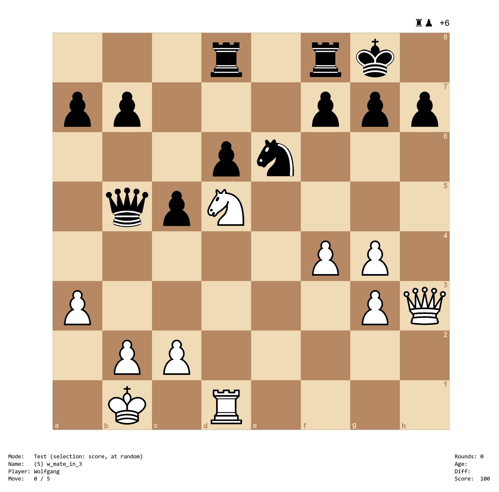

chesstrainer: An R Package to Create and Test Yourself on Chess Lines
=====================================================================

## Description

The purpose of the `chesstrainer` package is to create sequences of moves (lines), save them, and then test yourself on these sequences. This is especially useful for training openings, but can also be used for creating chess puzzles or training tactics. Can you find the forced mate below?



## Installation

The development version of the `chesstrainer` package can be installed with:
```r
install.packages("remotes")
remotes::install_github("wviechtb/chesstrainer")
```

## Play

To start playing, first load the package with `library(chesstrainer)` and then type: `play()`. For an introduction, type: `help(chesstrainer)` or read the documentation online at [https://wviechtb.github.io/chesstrainer/](https://wviechtb.github.io/chesstrainer/).

## For Non-R Users

If you are not an R user, but still would like to use the trainer, you will first have to install R, which is freely available from [here](https://cran.r-project.org]). Once R is installed, start up R and then enter the commands above for installing the package after the prompt (`>`) on the 'R Console'. If you receive a prompt whether to use/create a personal library, answer 'Yes'. If you are asked for a download location, you can select the first choice. Once the package is installed, type `library(chesstrainer)` to load the package and `play()` to start the trainer.

## Meta

The `chesstrainer` package is licensed under the [GNU General Public License Version 3](https://www.gnu.org/licenses/lgpl-3.0.txt). To report any issues or bugs, please go [here](https://github.com/wviechtb/chesstrainer/issues).
